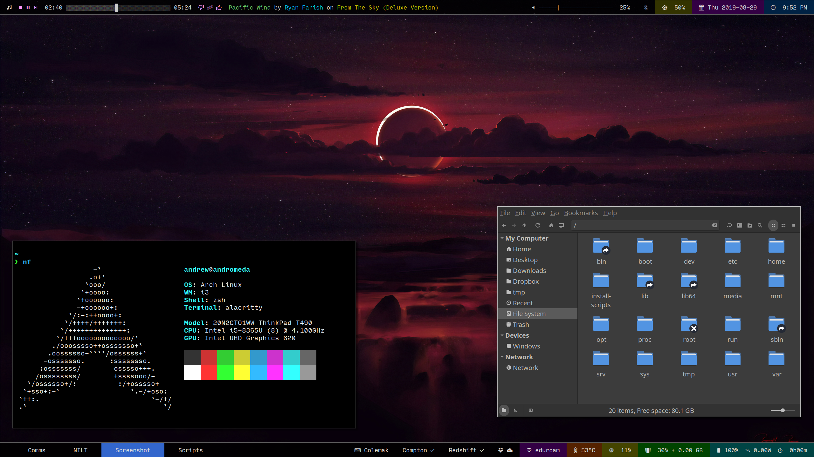

# Dotfiles

These are my [dotfiles](https://askubuntu.com/questions/94780/what-are-dot-files). Use them however you see fit.

I am currently dual-booting Windows 10 with i3wm on Arch Linux, using Linux as my primary driver.

## Software

* **Boot manager:** [rEFInd][refind]
    * **Theme:** [Custom][custom-refind-theme] based on [Ursa Major][ursa-major-refind-theme]
* **Kernel:** Linux 5.x.x
* **Distro:** [Arch Linux][arch-linux]
* **Display manager:** [LightDM][lightdm]
* **Window manager:** [i3wm][i3wm]
    * **Bar**: [Polybar][polybar]
    * **Launcher**: [Rofi][rofi]
* **Terminal:** [Alacritty][alacritty]
    * **Shell:** [Zsh][zsh]
        * **Plugin manager:** [Antigen][antigen]
        * **Prompt:** [Spaceship][spaceship-prompt]
    * **Color scheme:** [Custom][custom-terminal-colors]
* **Dotfiles manager:** [Yadm][yadm]

[refind]: https://www.rodsbooks.com/refind/
[custom-refind-theme]: https://github.com/HactarCE/Arch-Install-Scripts/tree/master/refind/themes/hactar-rEFInd
[ursa-major-refind-theme]: https://github.com/kgoettler/ursamajor-rEFInd
[arch-linux]: https://www.archlinux.org/
[lightdm]: https://github.com/canonical/lightdm
[i3wm]: https://i3wm.org/
[polybar]: https://polybar.github.io/
[rofi]: https://github.com/davatorium/rofi
[alacritty]: https://github.com/jwilm/alacritty
[zsh]: https://www.zsh.org/
[antigen]: http://antigen.sharats.me/
[spaceship-prompt]: https://denysdovhan.com/spaceship-prompt/
[custom-terminal-colors]: https://github.com/HactarCE/dotfiles/blob/master/.config/alacritty/alacritty.yml#L205-L225
[yadm]: https://yadm.io/

### Applications

* **Web browser:** [Firefox][firefox]
* **File browser:** [Nemo][nemo]
* **Password manager:** [Bitwarden][bitwarden]
* **Music:** [Pianobar][pianobar] (with [custom wrapper for Polybar][polianobar])

[firefox]: https://www.mozilla.org/en-US/firefox/
[nemo]: https://github.com/linuxmint/nemo
[bitwarden]: https://bitwarden.com/
[pianobar]: https://6xq.net/pianobar/
[polianobar]: https://github.com/HactarCE/dotfiles/blob/master/.config/pianobar/polianobar.py

### Daemons

* **Gesture daemon:** [Libinput-gestures][libinput-gestures]
* **Sound daemon:** [PulseAudio][pulseaudio]
    * **Mixer UI:** [PAVUControl][pavucontrol]
* **Compositor:** ~~[Compton][compton]~~ [Picom][picom]
* **Notification daemon:** [Dunst][dunst]

[libinput-gestures]: https://github.com/bulletmark/libinput-gestures
[pulseaudio]: https://www.freedesktop.org/wiki/Software/PulseAudio/
[pavucontrol]: https://freedesktop.org/software/pulseaudio/pavucontrol/
[compton]: https://github.com/yshui/compton
[picom]: https://github.com/yshui/picom
[dunst]: https://dunst-project.org/

### Editors

* **Text editor:** [Sublime Text 3][sublime-text-3]
    * **Theme:** [Spaceblack][st3-spaceblack]
    * **Color scheme:** [Spaceblack][st3-spaceblack]
    * **Modal editing plugin:** [Custom][custom-modal-editing]
* **Bitmap image editor:** [GIMP][gimp]
* **Vector image editor:** [Inkscape][inkscape]
* **Video editor:** [Kdenlive][kdenlive]

[sublime-text-3]: https://www.sublimetext.com/
[st3-spaceblack]: https://packagecontrol.io/packages/Theme%20-%20Spaceblack
[custom-modal-editing]: https://github.com/HactarCE/dotfiles/tree/master/.config/sublime-text-3/Packages/Hactar
[gimp]: https://www.gimp.org/
[inkscape]: https://inkscape.org/
[kdenlive]: https://kdenlive.org/en/

### Utilities

* **Calculator:** [SpeedCrunch][speedcrunch]
    * **Color scheme:** [Behave][custom-behave] ([original][st3-behave])
* **Character picker:** [Gucharmap][gucharmap]
* **Color picker:** [Gcolor3][gcolor3]

[speedcrunch]: https://speedcrunch.org/
[custom-behave]: https://github.com/HactarCE/dotfiles/blob/master/.local/share/SpeedCrunch/color-schemes/Behave.json
[st3-behave]: https://packagecontrol.io/packages/Behave%20Color%20Scheme
[gucharmap]: https://wiki.gnome.org/action/show/Apps/Gucharmap?action=show&redirect=Gucharmap
[gcolor3]: https://www.hjdskes.nl/projects/gcolor3/

## Configuration

### Fonts

* [Cantarell][font-cantarell] - i3wm (titlebars)
* [Input Mono][font-input] - bar, terminal
* [Iosevka SS04][font-iosevka] - text editor
* [Noto Sans][font-noto-sans] - Rofi
* [Roboto Mono][font-roboto-mono] [Nerd Font][nerd-font] - bar (symbols)

[font-cantarell]: https://fonts.google.com/specimen/Cantarell
[font-input]: https://input.fontbureau.com/
[font-iosevka]: https://typeof.net/Iosevka/
[font-noto-sans]: https://www.google.com/get/noto/
[font-roboto-mono]: https://fonts.google.com/specimen/Roboto+Mono
[nerd-font]: https://www.nerdfonts.com/

### GTK

* **GTK theme:** [Equilux-compact][equilux-theme]
* **GTK icon theme:** [Papirus-Dark][papirus-icon-theme]
* **Cursor theme:** [DMZ][dmz-cursors] (White)

[equilux-theme]: https://github.com/ddnexus/equilux-theme
[papirus-icon-theme]: https://github.com/PapirusDevelopmentTeam/papirus-icon-theme/
[dmz-cursors]: https://github.com/ganwell/dmz-cursors

### Other

* **BIOS logo:** [Thönkpad][bios-logo]
* **Keyboard layout:** [Colemak][colemak]
* **Wallpaper:** [Factorio background][wallpaper-factorio] (previously [sunset wallpaper][wallpaper-sunset])

[bios-logo]: .readme_content/logo.gif
[colemak]: https://colemak.com/
[wallpaper-factorio]: https://images5.alphacoders.com/778/thumb-1920-778421.jpg
[wallpaper-sunset]: https://whvn.cc/j5v28q

## Hardware

* **Model:** Lenovo Thinkpad T490
* **CPU:** Intel Core i5-8365U
* **Memory:** 16 GB
* **Resolution:**
    * Internal: 2560x1440 (144 DPI)
* **Graphics:** Intel UHD Graphics 620
* **Peripherals:**
    * Logitech G600 MMO Gaming Mouse
